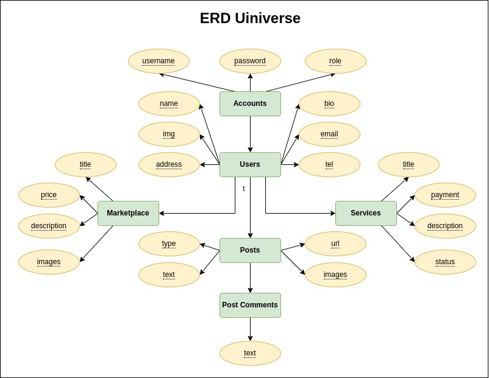

# Ide Bisnis: Aplikasi Sosial Media dan Manajemen Aktivitas Mahasiswa

## Deskripsi

Aplikasi ini diharapkan dapat digunakan oleh seluruh mahasiswa UIN dalam bersosial media di lingkungan kampus berikut dengan manajemen pribadi aktivitas di lingkungan kampus.

### Mobile Mahasiswa

- Marketplace (Jual Beli)
- Service (Jasa)
- Forum (Komunitas Bersama)

---

- Penjadwalan & Notifikasi (Local storage dengan local notification)
- Catatan sederhana (Local storage)
- Web penting UIN SGD
- Informasi Covid 19 (Redirect ke website covid dunia)

## Entitas dan Atribut

### accounts

- (PK) id
- username
- password
- role
- created_at

### users

- (PK) id
- (FK) account_id
- name
- img
- address
- bio
- tel
- ig
- email
- information
- updated_at

### marketplace

- (PK) id
- (FK) user_id
- title
- price
- location
- description
- images
- thumbnail
- status
- created_at
- updated_at

### services

- (PK) id
- (FK) user_id
- title
- payment
- location
- description
- status
- created_at
- updated_at

### posts

- (PK) id
- (FK) user_id
- type
- text
- url
- images
- status
- views
- comment_views
- created_at
- updated_at

### post_comments

- (PK) id
- (FK) post_id
- (FK) user_id
- text
- created_at
- updated_at
