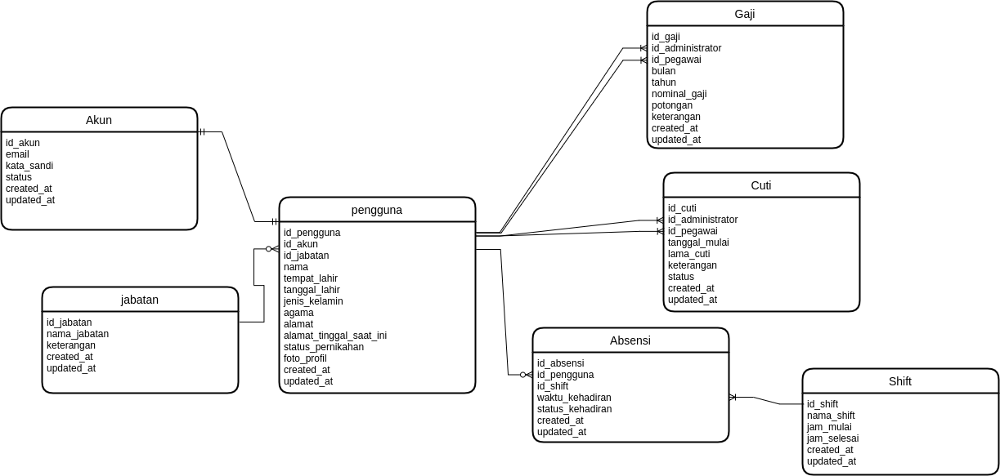

### Berikan contoh pemanfaatan data historis
Jawab: Pemanfaatan data historis dapat kita temui dalam banyak bidang. Bahkan hampir semua sektor baik di industri, pemerintahan, dan lain sebagainya menggunakan pemanfaatan data historis. Sebut saja pada bidang pendidikan yang dapat memanfaatkan data historis dalam hal perkembangan belajar siswa, perkembangan kinerja tenaga pengajar, pengeluaran & pemasukan anggaran, dan lain sebagainya. Data histori pada sektor pendidikan biasanya ditampilkan nantinya dalam bentuk grafik chart. 
###
Contoh lain yang dapat kita temui adalah pada sektor industri salah satunya pada bagian kepegawaian. Saya pernah mengerjakan satu proyek management kepegawaian (Duh lupa ERDnya dulu di laptop lama) yang dapat melacak data histori cuti pegawai, kehadiran, gaji, kinerja, pangkat, dan lain sebagainya. Kebetulan juga kemarin banget saya handle satu proyek bagian kepegawaian dan salah satunya mengerjakan retrieve data absensi pegawai salah satu perusahaan di Cikarang dari fingerprint absensinya.. Proses menarik datanya dari database ms access lalu setelah dalam bentuk array diinsert ke database management kepegawaian. Data dari tahun 2010 pun masih tersimpan rapi dan itu dimanfaatkan untuk melihat banyak hal seperti, apakah pegawai dengan NIK ini pernah bekerja di sini? Bagaimana kinerja & kehadiran pegawai saat menjelang habis kontrak? Apakah akan diperpanjang atau tidak? Itu semua dapat dipantau berkat adanya pemanfaatan data historis.

### ERD Kepegawaian


```sql
CREATE TABLE akun (
  id_akun int(11) NOT NULL AUTO_INCREMENT PRIMARY KEY,
  email varchar(100) NOT NULL UNIQUE KEY,
  kata_sandi varchar(150) NOT NULL,
  status enum('Aktif','Tidak Aktif') NOT NULL,
  created_at timestamp NOT NULL DEFAULT current_timestamp() ON UPDATE current_timestamp(),
  updated_at timestamp NOT NULL DEFAULT '0000-00-00 00:00:00'
) 
```

```sql
CREATE TABLE pengguna (
  id_pengguna int(11) NOT NULL AUTO_INCREMENT PRIMARY KEY,
  id_akun int(11) NOT NULL,
  id_jabatan int(11) NOT NULL,
  nik varchar(30) NOT NULL UNIQUE KEY,
  nama varchar(100) NOT NULL,
  tempat_lahir varchar(20) NOT NULL,
  tanggal_lahir date NOT NULL,
  jenis_kelamin enum('laki-laki','perempuan') NOT NULL,
  agama enum('Islam','Protestan','Katolik','Hindu','Buddha','Konghuchu') NOT NULL,
  alamat text NOT NULL,
  alamat_tinggal_saat_ini text NOT NULL,
  status_perkawinan enum('kawin','belum_kawin') NOT NULL,
  foto_profil varchar(120) NOT NULL,
  created_at timestamp NOT NULL DEFAULT current_timestamp(),
  updated_at timestamp NOT NULL DEFAULT '0000-00-00 00:00:00' ON UPDATE current_timestamp()
) 
```

```sql
CREATE TABLE jabatan (
  id_jabatan int(11) NOT NULL AUTO_INCREMENT PRIMARY KEY,
  nama_jabatan varchar(50) NOT NULL,
  keterangan tinytext NOT NULL,
  created_at timestamp NOT NULL DEFAULT current_timestamp(),
  updated_at timestamp NOT NULL DEFAULT '0000-00-00 00:00:00' ON UPDATE current_timestamp()
) 
```


```sql
CREATE TABLE absensi (
  id_absensi int(11) NOT NULL AUTO_INCREMENT PRIMARY KEY,
  id_pengguna int(11) NOT NULL,
  shift enum('Shift 1','Shift 2','Shift 3') NOT NULL,
  check_in timestamp NOT NULL DEFAULT current_timestamp() ON UPDATE current_timestamp(),
  check_out timestamp NOT NULL DEFAULT '0000-00-00 00:00:00',
  created_at timestamp NOT NULL DEFAULT '0000-00-00 00:00:00',
  updated_at timestamp NOT NULL DEFAULT '0000-00-00 00:00:00'
) 
```

```sql
CREATE TABLE cuti (
  id_cuti int(11) NOT NULL AUTO_INCREMENT PRIMARY KEY,
  id_administrator int(11) NOT NULL,
  id_pegawai int(11) NOT NULL,
  tanggal_mulai date NOT NULL,
  lama_cuti int(11) NOT NULL,
  keterangan text NOT NULL,
  jenis enum('sakit_keras','sakit','izin_keluarga','izin_pribadi','izin_kepengurusan','melahirkan') NOT NULL,
  created_at timestamp NOT NULL DEFAULT current_timestamp(),
  updated_at timestamp NOT NULL DEFAULT '0000-00-00 00:00:00' ON UPDATE current_timestamp()
) 
```

```sql
CREATE TABLE gaji (
  id_gaji int(11) NOT NULL AUTO_INCREMENT PRIMARY KEY,
  id_administrator int(11) NOT NULL,
  id_pegawai int(11) NOT NULL,
  bulan int(2) NOT NULL,
  tahun year(4) NOT NULL,
  nominal_gaji bigint(20) NOT NULL,
  potongan bigint(20) NOT NULL,
  keterangan text NOT NULL,
  created_at timestamp NOT NULL DEFAULT current_timestamp() ON UPDATE current_timestamp(),
  updated_at timestamp NOT NULL DEFAULT '0000-00-00 00:00:00'
) 
```


