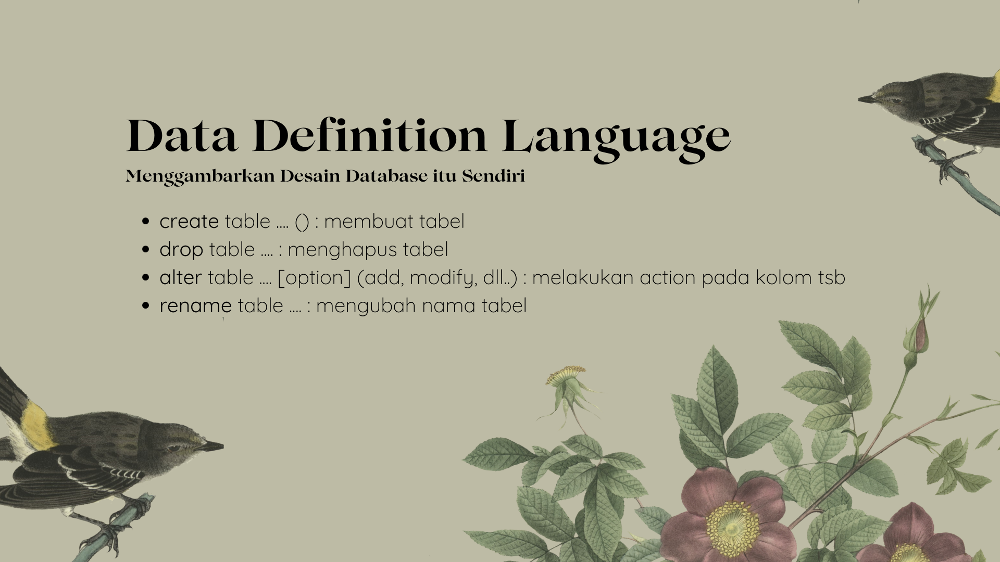
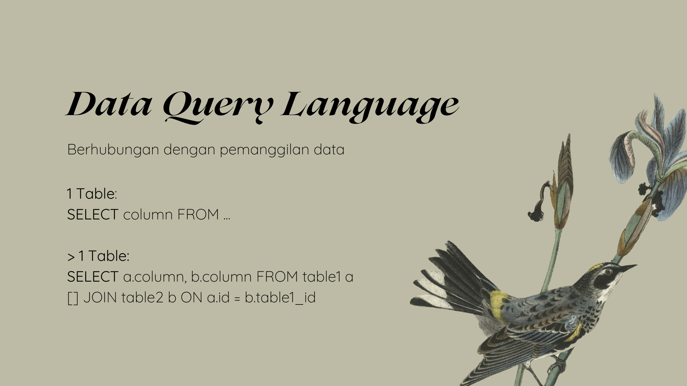

### Cheatset SQL






Get data penduduk > 25 tahun dari data [ini](https://github.com/insanalamin/IF214002/blob/main/pertemuan10/penduduk.sql)

```sql
SELECT *, TIMESTAMPDIFF(YEAR, tanggal_lahir, CURDATE()) as usia_saat_ini  FROM penduduk WHERE TIMESTAMPDIFF(YEAR, tanggal_lahir, CURDATE()) > 25 AND kode_kabupaten='3204';

```
