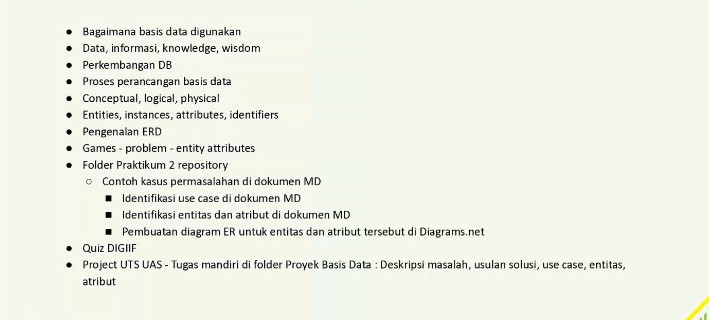

# Materi Teori Pertemuan 2
Perancangan ERD dibutuhkan untuk normalisasi dan keteraturan sebelum pembuatan Database.

## Ringkasan Materi

- Entitas = Objek utama dari proses bisnis
- Atribute = Menjelaskan sifat2 pelanggan
- 

##Kendala
- Bapak punten dari jam 8.40 saya pindah ke smartphone dan saya dengerin dari motor mau berangkat ke kantor pak, 🙏
