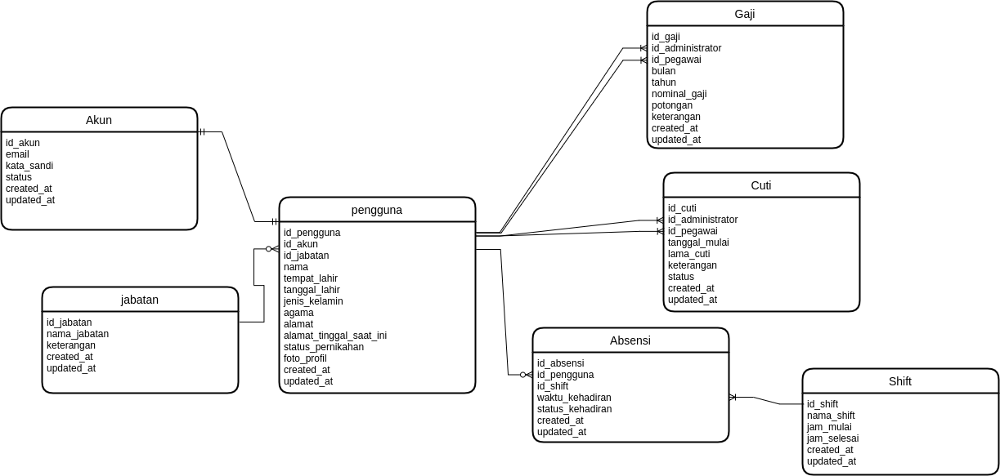

### Berikan contoh pemanfaatan data historis
Jawab: Pemanfaatan data historis dapat kita temui dalam banyak bidang. Bahkan hampir semua sektor baik di industri, pemerintahan, dan lain sebagainya menggunakan pemanfaatan data historis. Sebut saja pada bidang pendidikan yang dapat memanfaatkan data historis dalam hal perkembangan belajar siswa, perkembangan kinerja tenaga pengajar, pengeluaran & pemasukan anggaran, dan lain sebagainya. Data histori pada sektor pendidikan biasanya ditampilkan nantinya dalam bentuk grafik chart. 
###
Contoh lain yang dapat kita temui adalah pada sektor industri salah satunya pada bagian kepegawaian. Saya pernah mengerjakan satu proyek management kepegawaian (Duh lupa ERDnya dulu di laptop lama) yang dapat melacak data histori cuti pegawai, kehadiran, gaji, kinerja, pangkat, dan lain sebagainya. Kebetulan juga kemarin banget saya handle satu proyek bagian kepegawaian dan salah satunya mengerjakan retrieve data absensi pegawai salah satu perusahaan di Cikarang dari fingerprint absensinya.. Proses menarik datanya dari database ms access lalu setelah dalam bentuk array diinsert ke database management kepegawaian. Data dari tahun 2010 pun masih tersimpan rapi dan itu dimanfaatkan untuk melihat banyak hal seperti, apakah pegawai dengan NIK ini pernah bekerja di sini? Bagaimana kinerja & kehadiran pegawai saat menjelang habis kontrak? Apakah akan diperpanjang atau tidak? Itu semua dapat dipantau berkat adanya pemanfaatan data historis.

### ERD Kepegawaian

