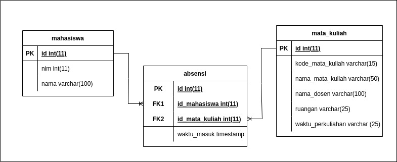

# Ide Bisnis: Sistem absensi masuk gedung fakultas



## Deskripsi

Absensi di lobby saintek masih pakai metode tulis manual dan rasanya itu menghambat waktu pada saat memasuki gedung saintek. Sistem ini akan menyederhanakan proses tersebut.

####

Data mahasiswa dan mata kuliah diimport dari database salam, adapun nantinya untuk kemudahan interaksi ada baiknya diintegrasikan dengan data salam lainnya seperti mahasiswa tsb memiliki matkul apa saja dan lainnya. Metode nya adalah scan KTM menggunakan barcode scanner atau ketik manual NIM, lalu pilih mata kuliah.

## Rancangan

### mahasiswa

- id (PK)
- nim (UNQ)
- nama

### mata_kuliah

- id (PK)
- kode_mata_kuliah
- nama_mata_kuliah
- nama_dosen
- ruangan
- waktu_perkuliahan

### absensi

- id (PK)
- id_mahasiswa (FK)
- id_mata_kuliah (FK)
- waktu_masuk

## Rancangan ERD


## Model Fisik Basis Data

### DDL

```sql
CREATE TABLE `mahasiswa` (
  `id` int(11) NOT NULL,
  `nim` int(11) NOT NULL,
  `nama` varchar(100) NOT NULL
);
```

```sql
CREATE TABLE `mata_kuliah` (
  `id` int(11) NOT NULL,
  `kode_mata_kuliah` varchar(15) NOT NULL,
  `nama_mata_kuliah` varchar(50) NOT NULL,
  `nama_dosen` varchar(100) NOT NULL,
  `ruangan` varchar(25) NOT NULL,
  `waktu_perkuliahan` varchar(25) NOT NULL
);
```

```sql
CREATE TABLE `absensi` (
  `id` int(11) NOT NULL,
  `id_mahasiswa` int(11) NOT NULL,
  `id_mata_kuliah` int(11) NOT NULL,
  `waktu_masuk` timestamp NOT NULL DEFAULT current_timestamp()
);
```

### DML

```sql
INSERT INTO `mata_kuliah` (`id`, `kode_mata_kuliah`, `nama_mata_kuliah`, `nama_dosen`, `ruangan`, `waktu_perkuliahan`) VALUES
(1, 'S-001', 'Basis Data', 'Muhammad Insan Al Amin MT', 'S4-5', 'Kamis, 07:00-08:40');
```

```sql
INSERT INTO `mahasiswa` (`id`, `nim`, `nama`) VALUES
(1, 1207050110, 'Rizki Aryandi');
```

```sql
INSERT INTO `absensi` (`id`, `id_mahasiswa`, `id_mata_kuliah`, `waktu_masuk`) VALUES
(1, 1, 1, '2022-06-30 02:59:24');
```

# DQL

(Get Data Kehadiran Mahasiswa di bulan 6)

```sql
SELECT mhs.nim, mhs.nama, SUM( CASE WHEN abs.id IS NOT NULL THEN 1 ELSE 0 END ) as jumlah_kehadiran FROM mahasiswa mhs LEFT JOIN absensi abs ON abs.id_mahasiswa = mhs.id LEFT JOIN mata_kuliah ON abs.id_mata_kuliah = mata_kuliah.id WHERE month(abs.waktu_masuk) = 6 GROUP BY mhs.nim;
```
