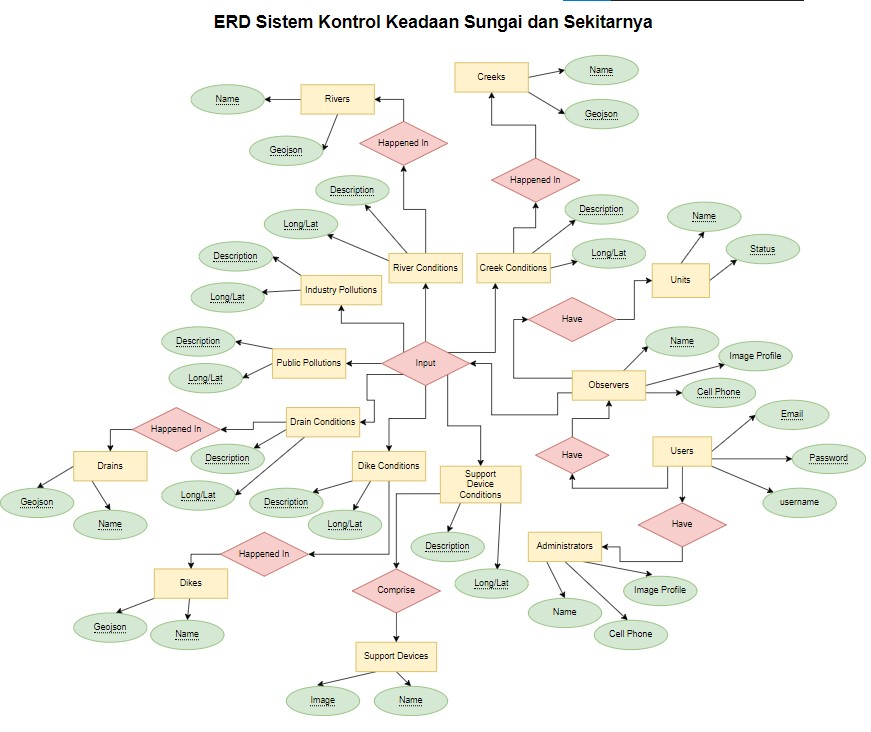

# 1. Basis data relasional dapat langsung dibangun menggunakan perintah SQL di sistem basis data seperti MySQL, dsb tanpa ada perancangan terlebih dahulu. Jelaskan apa keuntungan melakukan perancangan basis data terlebih dahulu (menggunakan ERD ataupun Class Diagram) !
## Jawab
Menurut saya, keuntungan perancangan sistem basis data menggunakan ERD ataupun Class Diagram bertujuan agar pada saat pengembangan database kita telah memiliki desain yang matang, hal ini menjadi kemudahan tersendiri pada pengembangan database nantinya. 
###
Kalau dalam bahasa Sunda itu ada istilah "panceg" atau teguh/kokoh. Nah agar si database itu nantinya "panceg" atau kokoh makanya dibikin rancangan database dahulu. Rancangan database itu sudah ada standar internasionalnya yaitu menggunakan notasi ERD ataupun Class Diagram.
###
Ibaratkan kita akan membangun suatu rumah, lebih baik kita desain dulu di atas kertas. Agar nantinya meminimalisir perombakan-perombakan. Bayangkan karena gaada desain udah bikin tiang tinggi 10 meter eh ternyata posisinya salah. Ya terpaksa harus dibongkar lagi makan biaya lagi. Itulah pentingnya suatu rancangan. ERD pada database dirancang untuk mendapatkan suatu rancangan database yang baik, tidak asal nyimpen. Pada ERD juga memudahkan saat proses normalisasi dan denormalisasi.  

### 
###
# 2. Jelaskan bagaimana cara mentransformasikan proses bisnis sebuah organisasi menjadi struktur data di basis data!
### Jawab
Pendapat saya pribadi, ketika seorang penganalisa sistem dapat memahami suatu proses bisnis, maka pemahamannya tersebut harus dijabarkan sesuai dengan standar bentuk basis data.
###
Kira-kira alur transformasi proses bisnis ke basis data menurut saya adalah:
1. Mulai dengan rancangan ERD
- Kategorikan terlebih dahulu apa saja yang dapat dijadikan entitas  
- Tentukan atributnya dari masing-masing entitas dan lebih baik dibuat intensitas juga dari masing-masing atribut
- Tentukan relasi antar entitas
- Normalisasi dan Denormaslisasi
2. Dari ERD tersebut dapat dibuatkan notasi ERD dilengkapi dengan tipe data dan key nya 
3. Kadang juga setelah itu perlu dibuat rancangan lain seperti penentuan trigger, procedure, function, jenis relasi (Cascade, restrict, dll) dan view.
4. Buat databasenya
### 
### 
###

# 3. Rancang solusi digital dari satu permasalahan yang ada di sekitar Anda. 
## A. Deskripsikan solusi digital tersebut dalam satu paragraf
## Jawab
Sistem monitoring keadaan sungai dan sekitarnya. Diwujudkannya aplikasi ini dibarengi dengan harapan dengan kehadiran aplikasi ini dapat memperbaiki kualitas sungai di Indonesia. Aplikasi ini terbagi atas 7 kategori di antaranya, monitoring keadaan aliran ruas besar, monitoring aliran ruas besar, monitoring aliran ruas kecil, monitoring aliran pemukiman penduduk, monitoring tanggul, monitoring dugaan pencemaran umum, monitoring dugaan pencemaran industri, dan monitoring perangkat penunjang. Pengguna aplikasi ini adalah petugas sebagai penginput informasi terkini dari perangkat mobile dan administrator sebagai pemonitor dari pusat menggunakan aplikasi berbasis website.
## B. Buat list fitur-fitur yang ada pada solusi digital tersebut
## Jawab
### Mobile Petugas:
- Input laporan keadaan aliran ruas besar
- Input laporan keadaan aliran ruas kecil
- Input laporan keadaan aliran pemukiman penduduk
- Input laporan keadaan tanggul
- Input laporan dugaan pencemaran umum
- Input laporan dugaan pencemaran industri
- Input keadaan perangkat penunjang

### Web Administrator
- Dashboard utama
- Manajemen keadaan aliran ruas besar (Include spasial lokasi)
- Manajemen keadaan aliran ruas kecil (Include spasial lokasi)
- Manajemen keadaan aliran pemukiman penduduk (Include spasial lokasi)
- Manajemen laporan keadaan tanggul (Include spasial lokasi)
- Manajemen laporan dugaan pencemaran umum (Include spasial lokasi)
- Manajemen laporan dugaan pencemaran industri (Include spasial lokasi)
- Manajemen kualitas air (Include spasial lokasi)
- Manajemen keadaan titik pantau (CCTV/Camera FTP)
- Manajemen keadaan perangkat penunjang
- Manajemen Users

#
## C. Buat ERD notasi Chen dari struktur data yang mewakili fitur2 di solusi digital tersebut
## Jawab

#
## D. Buat ERD notasi Crow Foot dari struktur data logical yang mewakili fitur2 di solusi digital tersebut, lengkap dengan keys, tipe data, dan normalisasi hingga bentuk ke 3
## Jawab
